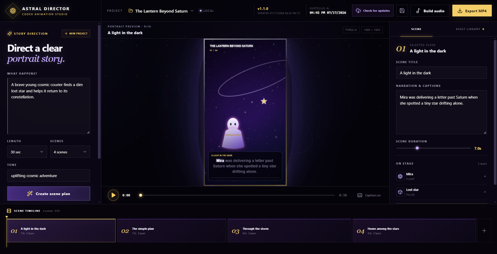

# Astral Director

Astral Director is a Windows and Apple Silicon macOS desktop animation studio that turns a simple or detailed story request into a clear, narrated portrait animation. It uses Codex Desktop for structured story planning and built-in image generation, Three.js for animation, native operating-system voices for narration, generated MIDI for music and sound effects, and FFmpeg for MP4 export.



## What it does

- Builds direct, easy-to-follow scene plans from natural-language prompts.
- Creates, renames, opens, and archives multiple local animation projects from an always-visible project manager.
- Generates reusable portrait backgrounds, characters, and objects through Codex Desktop without image API keys.
- Animates layered art with movement, rotation, glow, shake, squash, stretch, pulse, and staged entrances.
- Synchronizes native Windows or macOS voice narration with scrolling karaoke-style subtitles.
- Composes full-length MIDI music and scene-specific MIDI sound effects.
- Exports a 1080 × 1920 MP4 optimized for mobile viewing.
- Stores projects and generated art locally for reuse.
- Checks GitHub Releases from one in-app update button. Windows updates restart directly into the new version; macOS downloads and opens the matching Apple Silicon DMG.
- Displays the current Huntsville, Alabama time, installed version, and last release timestamp.
- Ships with a dedicated Astral Director app icon on Windows and macOS.

## Install

Download the newest build from [GitHub Releases](https://github.com/jetblackrlsh/AI-Agent-Animation-Maker-App/releases/latest):

- Windows x64: `Astral-Director-Setup-<version>.exe`
- Apple Silicon macOS: `Astral-Director-<version>-mac-arm64.dmg`

The macOS build is native ARM64 for Apple Silicon, including M5 systems; it does not require Rosetta. Open the DMG and drag **Astral Director** to Applications.

These are unsigned independent builds. Windows SmartScreen may show its standard warning. The macOS build has an ad-hoc integrity signature but is not Apple-notarized; on first launch, right-click the app and choose **Open**, or approve it in **System Settings → Privacy & Security**.

Image and story generation require a local, signed-in Codex installation. No OpenAI API key is requested or stored by this application.

## Development

Requirements: Node.js 22+, npm, and Codex CLI/Desktop. Windows narration uses System.Speech through PowerShell; macOS narration uses the built-in `say` voice system.

```powershell
npm install
npm run dev
```

Production checks and packaging:

```powershell
npm run build
npm run dist:win
npm run dist:mac # run on Apple Silicon macOS
```

## Publishing an update

1. Update the version and `releaseDate` in `package.json`.
2. Commit and push the change.
3. Tag the commit using the matching version, such as `v1.0.1`, and push the tag.
4. The release workflow builds Windows x64 and macOS ARM64 in parallel, verifies the native Apple Silicon architecture, then publishes both platforms and their update metadata to one GitHub Release.

Installed copies can then use **Check for updates**. The same button reports download progress and changes to **Restart to install** on Windows or **Open DMG to install** on macOS when the update is ready.

## Privacy and security

- The renderer is sandboxed and has no Node.js access.
- File, process, Codex, speech, update, and export operations stay in the Electron main process behind narrow IPC methods.
- Generated images are recovered from local Codex task logs and copied into the app-owned asset library.
- The source contains no direct image API integration and stores no model API keys.

## License

MIT
